# oneNet
:toc:

## 简介

`oneNet` 复用和重构了 https://github.com/fatedier/frp[frp] 和 https://github.com/Dreamacro/clash[clash] 程序，配合 https://github.com/fatedier/frp[frp] 的 `frps` 服务端可以很简单的实现【内网服务映射至互联网】、【安全的访问内网服务】、【内网全网穿透】和【网络代理】功能。

程序默认会监听 `17400`、`19090`、`17891` 三个本地端口，请确保端口未被占用，同时【网络代理】功能会默认监听 7890 端口，可按需调整，暂只能提供 http/https 网络代理。

## 支持平台

`oneNet` 用的 `go` 语言开发，理论上讲 `go` 语言支持的平台都可以支持，但因作者精力有限，将只放出 `windows`、`linux`、`darwin` 的 `amd64` 和 `arm64` 版本。

其中因作者暂无 `darwin` 环境， `darwin` 平台暂未做测试；同样原因，因作者暂无 `arm64` 环境，`arm64` 平台暂未做测试。

## 使用说明

### 参数

* `-v` 显示当前版本
* `-install` 安装为守护服务
* `-uninstall` 从守护服务中删除

### 运行

以运行二进制程序方式运行即可，其中 `windows` 也可直接双击运行。

其中，【全局代理】功能需要管理员权限才能正常运行，所以建议以管理员身份运行本程序（`windows` 版本做了定制，只需要当前账户拥有管理员权限即可，可自动获取管理员身份）。

启动后根据提示输入 `frps` 信息后，即可进入主界面；若无 `frps` 服务，也可直接按回车键，获取临时服务，当天有效，且只有 `11000-16000` 之间的端口可用：

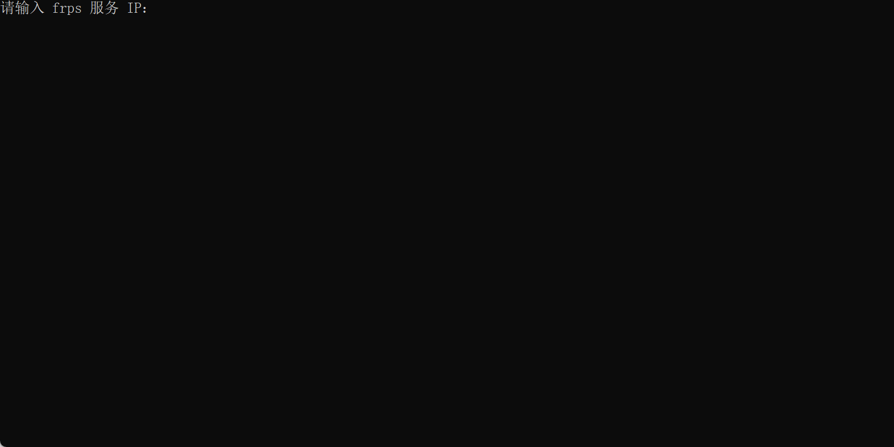

## 配置
[red]#隐藏选项：q 返回上一级，qq 直接退出程序#

### 内网服务映射至 frps 互联网

将内网 `127.0.0.1:80` 服务映射至 `frps` 互联网（需要 `frps` 服务器开放相应的端口后才能正常使用）：

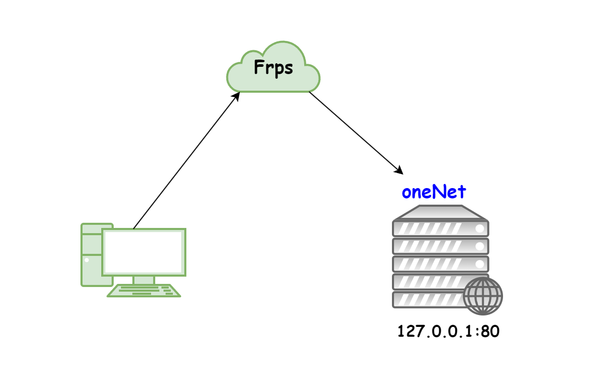 

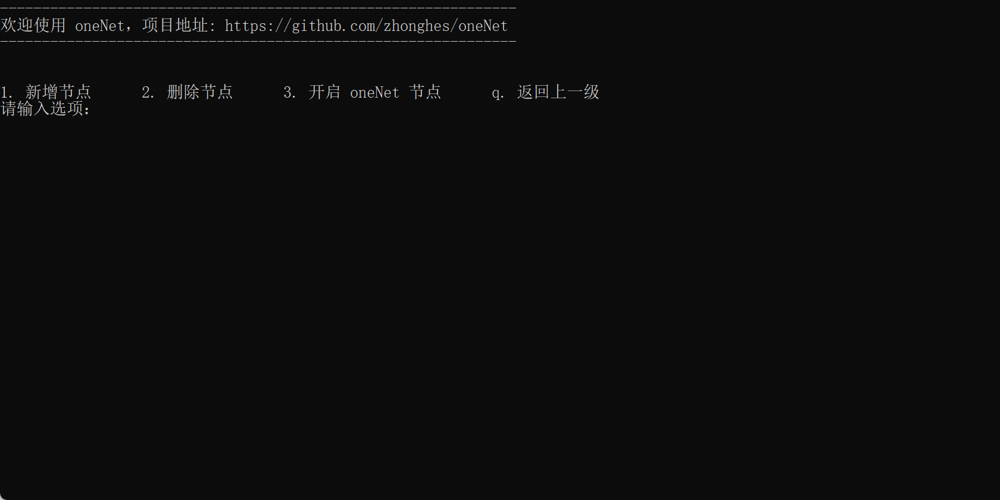

### 安全的访问内网服务

将内网的 `127.0.0.1:80` 服务，映射至本机的 `127.0.0.1:8080` 端口

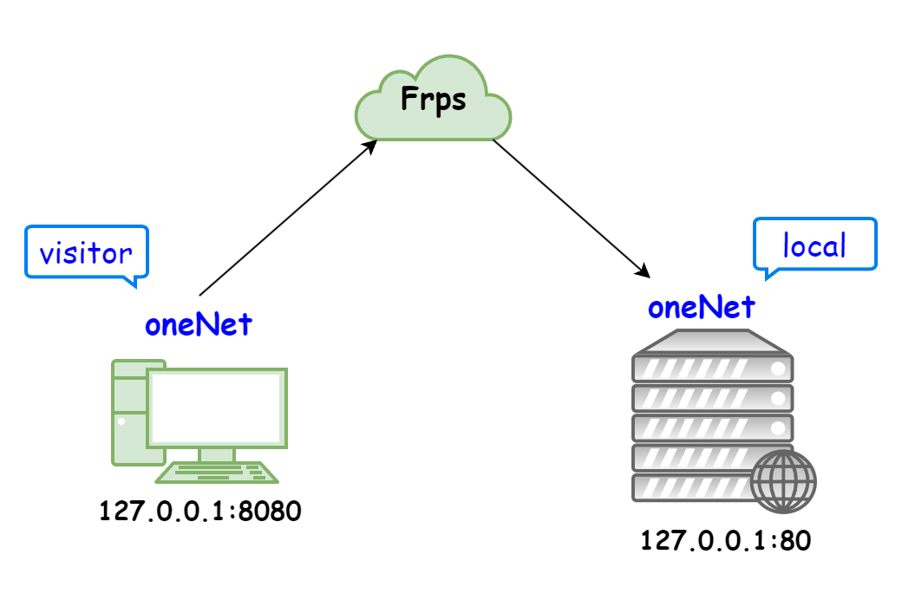 

#### 首先在内网新增安全节点 

新增安全节点 `local`：

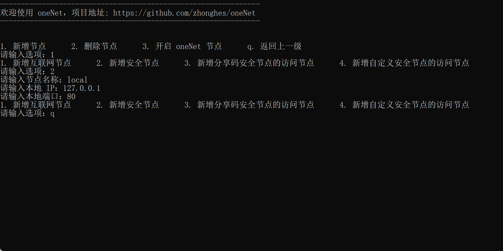

#### 然后在本机新增访问节点

新增安全节点的访问节点 `local_visitor`：

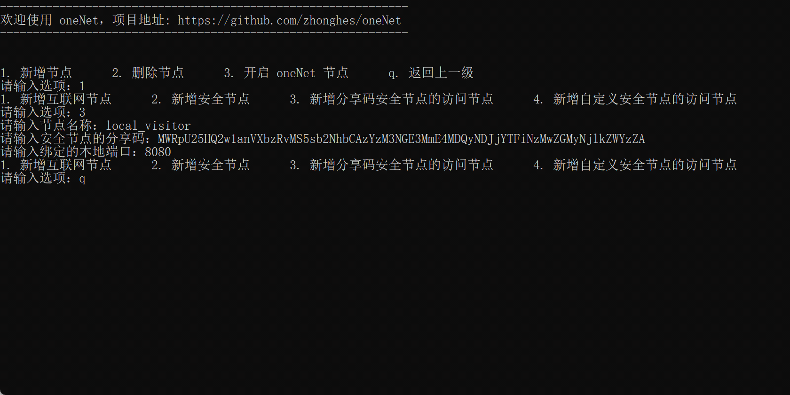

### 内网全网穿透

将内网的 `172.16.6.0/24` 整个网段映射至本机网络

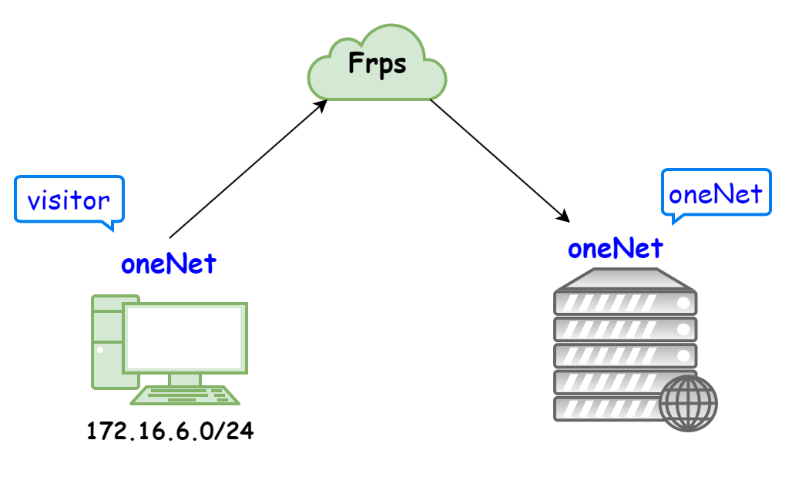 

#### 首先在内网开启 oneNet 服务

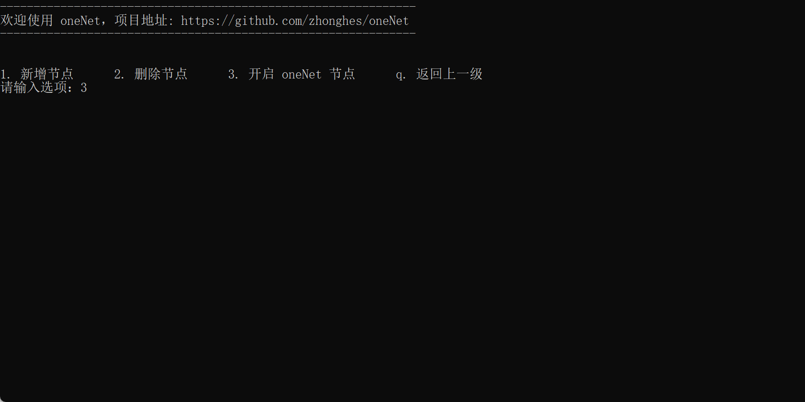

#### 然后在本机新增 oneNet 服务的访问节点，并配置路由

配置完成后，即可像是在内网服务器上一样，访问 `172.16.6.0/24` 网络

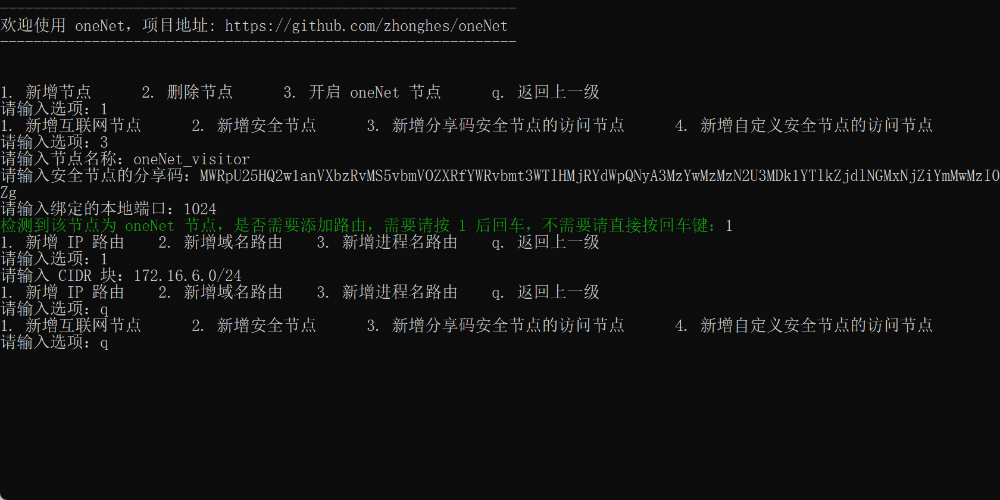

### 网络代理

同时支持 `http/https` 代理，默认端口 `7890`，可按需修改

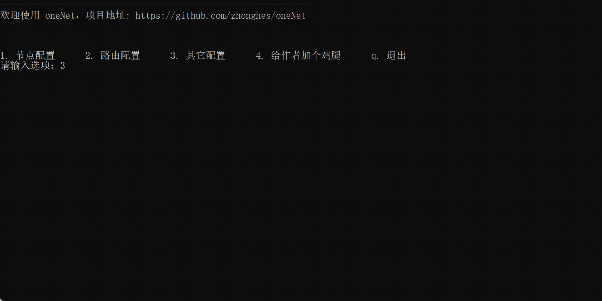

## FAQ
对于 `windows` 旧版用户无法复制的问题，可以如下方式操作：
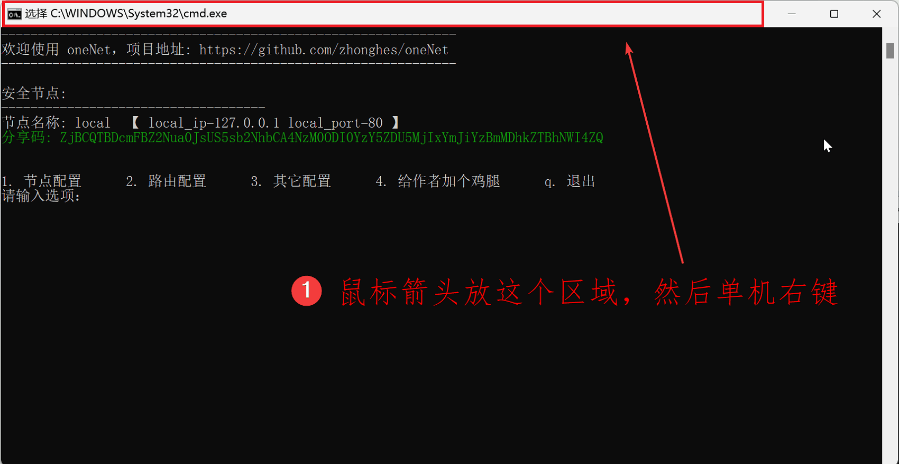

## 开发不易，给作者加餐

image:doc/image/wei_xin_qrcode.png[width="300px"]

## 项目协议
本项目可免费使用，但不对项目内的技术可能存在违反当地法律法规的行为作保证，禁止在违反当地法律法规的情况下使用本项目，对于使用者在明知或不知当地法律法规不允许的情况下使用本项目所造成的任何违法违规行为由使用者承担，本项目不承担由此造成的任何直接、间接、特殊、偶然或结果性责任。

若你使用了本项目，将代表你接受以上协议。
